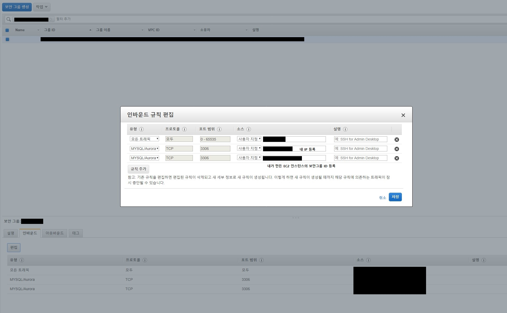
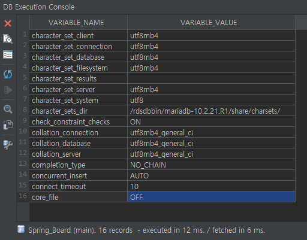

# RDS 생성 및 설정하기  

<br>

## RDS 생성하기
1. RDS로 들어가서 DB를 생성한다. MariaDB를 선택, 표준생성 으로 진행한다.

2. MariaDB 10.2.21로 버전을 선택하고 템플릿은 프리티어를, 스토리지 유형은 SSD, 스토리지 용랴은 20GIB, DM 인스턴스 클래스는 db.t2.micro를 선택한다.

3. 퍼블릭 액세스를 예로 선택한다, 이후 특정 IP에서만 접속이 가능하게 보안그룹을 변경할 것이다.

## RDS 운영환경에 맞는 파라미터 설정하기

우리가 설정해야 하는것은 3가지 이다.
- 타임존
- Character Set
- Max Connection

1. 파라미터 그룹에 가서 파라미터 그룹생성을 클릭한다.

2. 우리가 만들었던 DB버전과 파라미터에 생성될 DB버전이 같아야한다. 파라미터 그룹 패밀리를 mariadb 10.2로 설정한다.

3. 생성후 파라미터 편집을 누른다.

4. `time_zone` 파라미터를 `Asia/Seoul` 로 변경한다.

5. Character Set을 변경해야 하는데 항목이 여러개 이다.
```
    character_set_client = utf8mb4
    character_set_connection = utf8mb4
    character_set_database = utf8mb4
    character_set_filesystem = utf8mb4
    character_set_results = utf8mb4
    character_set_server = utf8mb4
    collation_connection = utf8mb4_general_ci
    collation_server = utf8mb4_general_ci
```
utf8 이 아닌 utf8mb4로 설정해 주어야 한다. utf8은 이모지를 저장할 수 없지만 utf8mb4는 이모지를 저장할 수 있게 해준다,
그래서 보편적으로 utf8mb4를 많이 사용한다.

6. 마지막으로 `max_connections`를 `150`으로 변경해 준다, max_connections는 인스턴스의 사양에 따라 자동으로 정해지는데 현재 프리티어에서는 60개 정도만 가능해 넉넉하게 150개로 변경해주는 것이다.

----------------------------------------


## 생성된 파라미터 그룹을 DB에 연결하기
RDS -> 데이터베이스를 눌러 아까 생성했던 DB를 체크하고 수정을 누른다. 현재 설정되어 있는 파라미터 그룹은 default일 텐데 우리가 만든
파라미터 그룹으로 DB 파라미터 그룹을 변경해준다. 그리고 수정사항을 적용할때 즉시적용을 눌러 적용해준다. 변경사항이 적용될때 서비스가 수정 반영시간동안
동작하지 않을 수 있어 새벽에 적용되게 하는게 '예약된 다음 유지 관리 기간에 적용' 옵션인거 같은데 서비스중이 아니라면 '즉시 적용'을 선택해준다.

수정이 완료되면 간혹 파라미터 그룹이 제대로 반영이 안되는 경우가 있으니 DB를 재부팅 해주자 (DB 체크후 작업 탭에서 재부팅을 누르면 됨)

<br>

## RDS 보안그룹 설정하기-
내가 만든 데이터베이스 이름을 클릭해 세부정보 페이지로 들어가면 보안 섹션에서 '보안그룹' 항목으로 들어간다.
맨 밑에 인바운드 에서 편집을 눌러 내 IP와 EC2 인스턴스의 그룹 ID를 RDS 보안그룹의 인바운드로 추가하면 된다.



위에 이미지처럼 유형은 `MYSQl/Auror`을 선택하고 추가해주면 된다. `MYSQl/Auror`를 선택하면 포트는 자동으로 3306이 된다
이렇게 하면 EC2와 RDS간에 접근이 가능해진다. 나중에 EC2가 2~3대가 될수도 있는데 매번 IP를 등록할 수 없으니 보편적으로
그룹간에 연동을 사용한다고 한다.

<br>

추가로 한가지 더 필요한 부분이 있다. 실제 DB에 접속해서 `collation_database`의 값을 `utf8mb4_general_ci`로 변경해 주어야 한다는 것이다.
파라미터 그룹의 세팅에서는 collation_database을 변경해 줄수가 없어서 직접 DB에 접속해 쿼리문으로 변경해주어야 하는 과정이 필요 하다

```
show variables like 'c%';
```
DB에 접속해 위 내용과 같이 쿼리를 날리면 세팅정보가 나올텐데 collation_database의 값이 `latin 1`로 되어있을 것이다.

```
ALTER DATABASE 데이터베이스명
CHARACTER SET = 'utf8mb4'
COLLATE = 'utf8mb4_general_ci';
```
이렇게 쿼리를 실행해 보면 character set이 변경되었을 것이다.

다시 `show variables like 'c%';`를 실행해 확인해보자 



이렇게 나온다면 정상적으로 변경이 완료된 상태이다.

설정이 모두 끝났으니 ssh로 접속해 접근테스트를 해보자

1. sudo yum install mysql로 설치를 한다.
2. `mysql -u 계정 -p -h Host주소` 를 입력한다. 여기서 Host 주소는 RDS에서 만들어준 엔드포인트 이고 id,pw 는 DB생성할때 입력했던 값이다.
3. `show databases;` 를 입력해 우리가 생성한 RDS가 맞는지 DB목록을 확인해보자.


