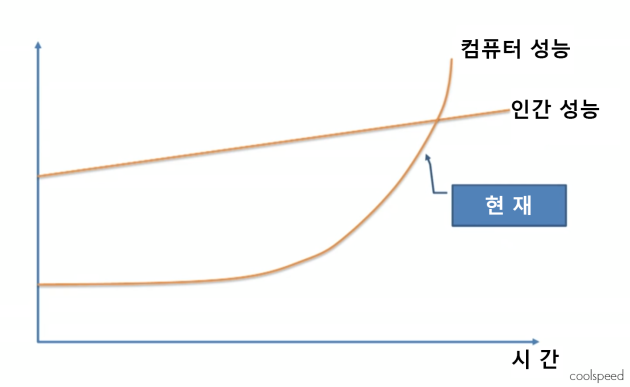

# 엘론 머스크, 스티븐 호킹 등 많은 유명인들이 인공지능을 경계하라고 호소하는가?

**이 글은 Tim Urban 의 The AI Revolution를 번역하신 coolspeed님의 글을 요약한 글입니다.**

저자: Tim Urban

원문링크:
* Part I: [The AI Revolution: The Road to Superintelligence](https://waitbutwhy.com/2015/01/artificial-intelligence-revolution-1.html)
* Part II: [The AI Revolution: Our Immortality or Extinction](https://waitbutwhy.com/2015/01/artificial-intelligence-revolution-2.html)

번역: [coolspeed](https://coolspeed.wordpress.com/2016/01/03/the_ai_revolution_1_korean/)

 

## "모든 종은 결국 멸종될 것이다."
#### 영생인가, 멸종인가

역사적으로 보면 “모든 종은 결국 멸종될 것이다” 란 말은 마치 “모든 사람은 결국 죽게 될 것이다” 란 말만큼이나 말이 된다. 지금까지 존재했던 생물 종들의 99.9% 가 모두 존재의 평균대에서 떨어졌다. 만약 어느 종이 아직까지 존재의 평균대 위에서 계속 걷고있다면 어떤 한줄기 자연의 바람이 휘몰아쳐 그 종을 평균대에서 떨어뜨리는 것은 오직 시간 문제이다. Bostrom 은 멸종을 일종의 흡인상태로 취급한다 — 모든 종은 모두 그곳으로 추락될 위험이 있으며 한번이라도 떨어지면 다시 돌아올 길이 없다.

 
 

비록 대부분 과학자들이 모두 하나의 초인공지능이 인류를 멸종시킬 능력이 있다고 인정하지만 그중 일부는 잘만 대처하면 초인공지능은 인류와 기타 종을 도와 다른 하나의 흡인상태 — 영생에 도달할 수 있다고 믿는다. Bostrom 은 종의 영생은 멸종과 마찬가지로 흡인상태라고 믿는다. 즉 우리가 한번 영생에 도달하기만 하면 우리는 더이상은 멸종의 위험속에 노출되지 않게 된다 — 우리는 사망과 확률을 이겨낸 것이다. 그래서 비록 지금까지 절대다수의 종이 평균대에서 떨어져 멸종되었지만 Bostrom 은 평균대 밖에 두개의 면이 있다고 믿으며 다만 지금까지 지구상의 생명들은 모두 어떻게 다른 한 흡인상태로 가는지 몰랐을 뿐이라고 한다.

만약 Nick Bostrom 등 사상가들의 생각이 정말로 맞는 것이라면 ( 그리고 내가 읽은 자료들에 의하면 그들의 결론이 정말 맞는 것 같았다) 우리는 아래의 두가지 사실을 받아들일 수 밖에 없게 된다:

* 초인공지능의 출현은 사상 처음으로 종의 영생이라는 이 흡인상태가 가능하게 해줄 것이다.
* 초인공지능의 출현은 아주 엄청난 충격으로 될 것이며 이 충경은 인류를 평균대에서 떨어뜨려 둘중 하나의 흡인상태로 빠져들게 할 것이다.

아주 가능한 한가지 광경은 자연진화가 트립와이어를 밟았을 때 그것은 인류와 평균대 사이의 관계를 영원히 바꿔놓을 것이며 완전히 새호운 세계를 열어제낄 것이다 — 그때 인류가 존재하든 하지 않든.

그러면 지금의 문제는 **“우리는 언제 트립와이어를 밟을 것인가?”** 와 **“평균대에서 떨어진 우리는 어느 흡인상태로 빠질 것인가?”** 이다.

아무도 답을 모른다. 하지만 일부 아주 똑똑한 분들이 이미 수십년이나 생각을 굴려왔다. 그러면 아래 우리는 그것들이 어떤 것들을 생각해냈는지를 봐보도록 하자.

이런 사람들은 초지능이 멀지 않은 미래에 발생할 것이라고 믿고있다. — 비록 머신 러닝이 지금은 발전이 더디지만 기하급수적인 성장으로 인해 미래 수십년에는 빠르게 발전할 것이라는 것이다.

기타 분들 예를 들면 마이크로소프트의 공동창업자인 Paul Allen, 심리학자 Gary Marcus, 뉴욕 대학교 (NYU) 의 컴퓨터 과학자 Ernest Davis, 기술 창업자인 Mitch Kapor 등은 커즈와일 등 사상가들이 인공지능의 어려움을 과소평가했다고 생각하며 우리는 아직 트립와이어에 도달하기까지 굉장히 멀다고 믿는다.

하지만 커즈와일파들은 유일하게 과소평가된 것은 사실 기하급수적 성장의 포텐이라고 믿으며 자신들의 이론을 의심하는 사람들을 1985 년에 발전이 느린 인터넷을 보면서 인터넷이 장래에 큰 영향력이 있는 사물로 될 수 없다고 단정짓는 사람들과 비교한다.

의심자들은 지능 영역의 발전이 이루어야 하는 진보도 역시 기하급수적으로 성장하는 것이어서 기술 발전의 기히급수적 성장을 상쇄시킬 것이라고 믿는다.

이렇게 쟁론은 계속되왔고 지금도 계속되고있다.

Nick Bostrom 을 비롯한 세번째 진영도 있는데 위의 두 파별이 모두 자신들에 트립와이어의 시간에 대한 확신을 그토록 가질 이유가 없다고 생각하며 동시에 이런 두가지 의견을 갖고있다: a) 이 일은 멀지 않은 미래에 발생할 수도 있고, b) 이것 또한 모를 일이어서 생각보다 오래 걸릴 수도 있다.

그리고 이상 세가지 진영에 다 속해있지 않는 사람도 있다. 그 예로 철학가 Hubert Dreyfus 인데 세 진영 모두 너무 순진하다고 생각하며 트립와이어는 전혀 존재하지 않으며 초인공지능은 불가능할 것이라고 여긴다.

이상 모든 사람들의 관점을 모두 통틀어서 보면 어떤 모양새일까?

2013년에 Nick Bostrom 은 수백명의 인공지능전문가들을 대상으로 하는 설문조사를 진행했다. 설문조사의 내용은 “당신은 강인공지능이 언제 생길 것 같습니까?” 이고 상대방으로 하여금 낙관적인 예측 (강인공지능이 10% 의 가능성으로 이때 생길 것 같다) , 정상적인 예측 (강인공지능이 50% 의 가능성으로 이때 생길 것 같다) 과 비관적인 예측 (강인공지능이 90% 의 가능성으로 이대 생길 것 같다) 을 해보라고 했다.

조사 결과:

낙관 예측 중앙치 연도 (강인공지능이 10% 의 가능성으로 이때 생길 것 같다): 2022 년
정작적인 예측 중앙치 연도 (강인공지능이 50% 의 가능성으로 이때 생길 것 같다): 2040 년
비관적인 예측 중앙치 연도 (강인공지능이 90% 의 가능성으로 이대 생길 것 같다): 2075 년
즉 한 중앙치의 인공지능전문가는 25 년후인 2040 년 (역자주: 원문은 2015 년에 작성됐다) 에 강인공지능을 만들어낼 수 있다고 생각한다. 그리고 2075 년이란 비관적인 예측이 설명해주는 바는 당신이 만약 지금 충분히 젊었다면 반수이상의 인공지능전문가들이 당신이 살아있을 때 강인공지능이 실현됨을 볼 수 있을 가능성이 90% 이상이다.

다른 한 독립적인 설문조사는 작가 James Barrat 가 Ben Goertzel 의 해마다 개최되는 강인공지능 콘퍼런스에서 진행되었다. 그는 참여자들한테 강인공지능이 어느 해에 실현될 것 같은지 직접 물었다. 선택지는 2030년, 2050년, 2100년과 영원히 실현될 수 없다 총 네가지였다. 그 결과:

* 2030년: 42% 의 참여자들이 강인공지능이 실현될 수 있다고 대답했다.
* 2050년: 25% 의 참여자
* 2100년: 20%
* 2100년 이후: 10%
* 영원히 실현될 수 없다: 2%

이 결과는 Nick Bostrom 의 결과와 비슷하다. James Barrat 의 조사에서 3분의 2를 넘는 참여자들이 강인공지능이 2050 년에 실현될 것이라고 했으며 거의 반수 (42%) 의 사람들이 미래 15년 (2030년) 이면 실현될 수 있다고 했다. 그리고 2% 에도 달하지 않는 참여자만 강인공지능이 영원히 실현될 수 없을 것이라고 했다.

하지만 강인공지능은 트립와이어가 아니다. 트립와이어는 초인공지능이다. 그렇다면 전문가들의 초인공지능에 대한 생각들은 어땠을까?

Nick Bostrom 의 설문조사는 전문가들의 초인공지능에 대한 생각도 물었다. 선택지는 a) 강인공지능에 도달한 2년 내에, b) 강인공지능에 도달한 30년 내에. 설문조사의 결과는 아래와 같다:

중앙치 답안은 강인공지능으로부터 초인공지능으로 가는데 필요한 시간이 2년일 가능성은 10%도 안되고 30 년내에 도달할 가능성은 75%에 달한다고 답했다.

이상 결과로부터 우리는 한명의 중앙치 인공지능 전문가는 강인공지능으로부터 초인공지능으로 가는데 아마도 20년 정도가 걸릴 것이라고 생각하고있다는 것을 알 수 있다. 즉 우리가 얻을 수 있는 결론은 현재 전 세계의 인공지능 전문가들중 하나의 중앙치 예측은 우리가 2040 년 즈음에 강인공지능을 실현시키고 그 20 년 뒤인 2060 년에 초인공지능을 실현시킬 것이다 — 즉 트립와이어를 밟을 것이다.

물론 이상 모든 데이터들은 다 추측일 뿐이고 현재의 인공지능 영역의 전문가들이 중앙치 의견일 뿐이다. 하지만 이것이 우리에게 주는 중요한 정보는: 상당수의 이 영역에 대해 아주 전문적인 분들이 2060 년이 초인공지능 실현에 대한 합리적인 추측이라고 생각한다는 것이다 — 지금으로부터 45 년밖에 남지 않았다.