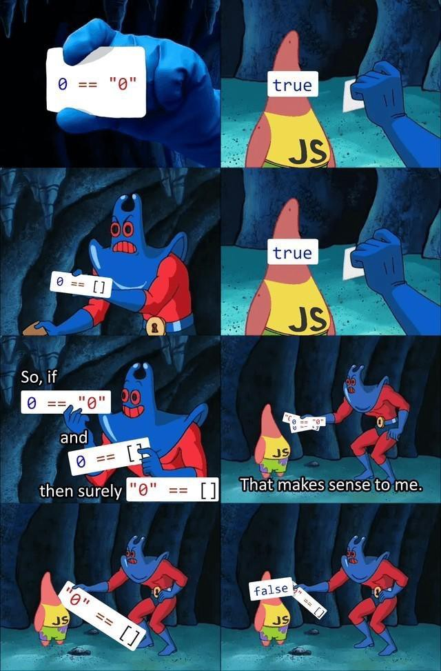

# 타이스크립트 공부하기

<br>

## 타입스크립트란 무엇인가?

[여기](https://www.typescriptlang.org/) 를 누르면 타입스크립트 공식 홈페이지로 이동할 수 있다.
기본적으로 자바스크립트는 1995년 넷스케이프사의 브렌던 아이크가 Navigator2 브라우저에 탑재하기 위하여 만들어진 스크립트 언어이다.

원래 목표가 웹페이지의 보조적인 기능을 수행하기 위함이였고, 초기 브라우저는 서버로 전달받은 html과 css를 렌더링하는 수준이였다. 점차
웹기술이 발전하면서 많은 역할과 기능들을 웹페이지에서 보여주어야 했다.  JavaScript의 가장 큰 논리적 장점은 개발자의 머릿속에서 구현하고 싶은 프로그램이 빠르게 프로토타이핑된다는 것 인데
이런 부분이 규모가 거대해지는 웹 어플리케인을 견고하게 하지 못하는 부분도 있다고 생각한다.
JavaScript 에는 "프로젝트가 진행될수록 JavaScript만으로 작성된 프로그램이 개발자의 의도대로 동작하는 지를 확인하기 힘들다"라는 한계가 있다.
지금 타입스크립트를 학습하고 이 글을 적는 나역시 자바스크립트가 주는 모호함과 이상하다고 생각되는 동작들(호출되는 방식에 따라 this의 값이 변하는 등)에 대해 다른 개발자들도 아쉬움이 있는 것이라고
생각한다.

타입스크립트는 자바스크립트를 확장한 언어로, JS 언어의 특성을 침범하지 않고 최신 ECMA 표준을 지원하고 견고한 웹 어플리케이션을 만들 수 있도록 해준다.
타입스크립트 공식문서에 `TypeScript is Typed Javascript at Any Scale.`이라고 가장먼저 배너영역에 적혀있듯, 타입스크립트는 자바스크립트에 타입이 입혀진 것이다.
이로인해 어떤 장점과 특징들을 가지는지 공부해보자.

<br>

## 타입스크립트의 장점

#### 1. Type 체크 
구글에 검색해보면 타입스크립트를 왜 사용해야 하는지 어떤 장점이 있는지에 대한 많은 글들이 나온다.
그중에도 타입스크립트로 인해 의도치 않은 동작을 방지할 수 있는 한가지 간단한 예제를 살펴보자.

```
let user = {}

function getInfo(){
    axios
        .get(url)
        .then(function (response) {
            response.data;
            username.innerText = user[0].name;
            email.innerText = user[0].email;
            address.innerText = user[0].address;
        })
        .catch(function(e){
            console.error(e)
        })
}
```

만약 axios로 서버에 요청을해 유저정보를 받아와 프론트에 보여주고 싶다면 위와같은 형태로 태그에 정보를 넣어주면 된다.
그런데 만약 username과 email은 단순 string이여서 잘 표현되지만 `user[0].adress`가 객체로 한번더 감싸져 있다면
화면상에서는 `[object object]` 라고 표기되게 될 것이다. 한번쯤 이런 상황을 다들 겪었을 것이다. 이런것 역시 타입스크립트를 사용하므로 인해
예방할 수 있는 버그이다, 최악의 순간은 어플리케이션이 실제 동작하는 과정에서 에러가 발생하는 것이다. 사용자가 실제 버튼을 눌러
API 호출후 버그가 발생하는 경우가 최악의 상황이라는 뜻이다. 그렇기 때문에 typescript코드를 컴파일해 javascript 코드로 변환해 동작을 실행하는 것이
의도치 않는 오류를 방지하는 장점을 주는 것이다, 단지 타입이 안맞는것 뿐만 아니라 값이 있어야 정상적으로 동작하는 경우, 즉 `user` 객체가 값이 존재해야 하는데
아무 값도 없는 `undefined` 상태라면 `user[0].name`을 대입하려고 하는 코드에서도 에러가 발생할 것이다.
타입스크립트를 사용해야만 타입을 지정할 수 있는것은 아니다.
`JSDoc`을 통해 표준문법으로 타입을 지정해 줄 수 있다.
난 JSDoc 이라는게 있는줄 최근에 처음알았다.. 실제 프로젝트에서 쓸것 같진 않은데 관심있다면 [여기](https://jsdoc.app/) 서 자세한 내용을 확인해 보자

<br>

#### 2. 견고함 한스푼 +1


위 이미지를 본적이 있는가?
자바스크립트의 모호함을 잘 알려주는 이미인 것 같다.
개인적으로 자바스크립트를 희안하다고 생각했던 것중 한가지가 this였다 자바스크립트 에서의 this는
함수가 호출되는 방식에 의해 달라진다. 기본적으로 this는 window, 즉 브라우저를 가르키는데
어떠한 객체의 메소드로써 함수가 호출될 때 this는 메서드가 포함된 객체를 가르킨다.
```
const myObj = {
    a: function(){console.log('this = ', this)}, // this = myObj
    b: 'b'
}
myObj.a()
```
위 코드를 살펴보자 `myObj.a`는 a라는 key에 value가 함수이고 그안에서 `this`는 `myObj.a`가 속해있는 `myObj`가 `this`가 된다.

```
const myObj2 = {
  a: function(){
    function innerFunc(){
      console.log('innerFunc this = ', this)
    }
    innerFunc()
  },
  b:'b'
}
myObj2.a()
```

위 코드를 살펴보자 `myObj2.a()`는 `this`가 어떻게 나올까? window가 나오게 된다.
나는 이부분이 조금 이상하다고 생각했다. 사실 함수가 실행되는 상태에 따라 this가 달라진다는 것 자체도 어색했다.
흔히 java 개발자들이 javascript를 배울때 this 때문에 혼란을 겪는 경우가 있다고 하는데, 나는 인생에 처음배운 개발언어가 javascript 였다.
물론 이런 동작이 비논리적이라거나 랜덤스러운 동작이라는 의미는 아니다, 자바스크립트는 규칙에 의해 실행되었고 내부동작을 깊이 파고들다보면
왜 이렇게 동작하는지에 대한 이유가 있겠지만 처음 자바스크립트를 공부할 때 이런 자바스크립트의 특징들이 내겐 많은 의문을 남겼다.
그리고 이런식의 동작이 javascript 언어의 설계상의 문제가 아니냐는 지적이 있는 것으로 알고있다. 현재 자바스크립트 개발을 할 때
함수호이스팅이나 this 때문에 모호한 상황을 만나는 경우는 거의 없을 것이다. 프레임워크 자체가 클로저나 함수호이스팅 같은 상황 때문에 난해함을
겪는 경우가 없도록 잘 만들어 졌기 때문 아닐까 싶다, 어찌되었거나 타입스크립트를 사용하므로 인해 javscript에 더욱 견고함을 더해주었다고 생각한다.
타입스크립트를 사용하므로 인해 어떤 타입을 받을 수 있는지 어떤 타입을 인자로 넘겨주어야 하는지 객체를 사용할 때에는 어떤 프로퍼티들이 있었는지 짧은 순간이나마
기억하려 애쓰지않아도 IDE의 `Code completion` 기능을 통해 더욱 편하게 사용할 수 있는 것이다.
vs code 이러한 자동완성 기능을 `Intellisense` 라고 표현하는 것 같다. 이런 자동완성 기능이 별 것 아닌것 같지만

<br>

## 타입스크립트 

